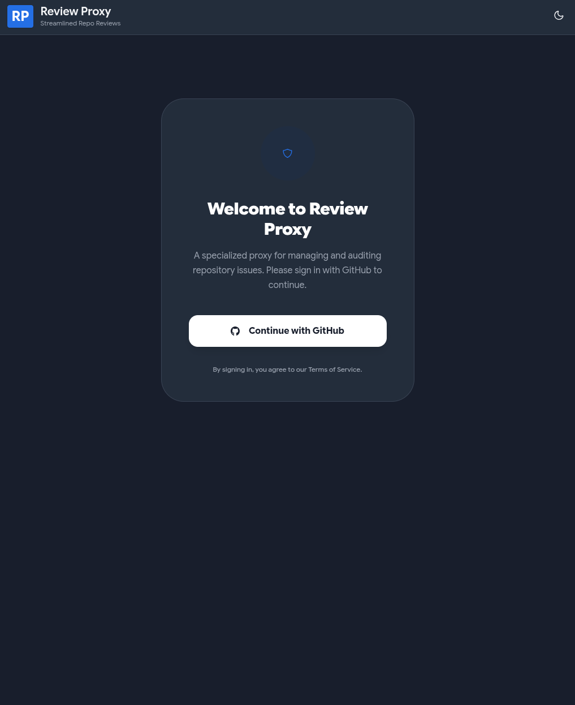
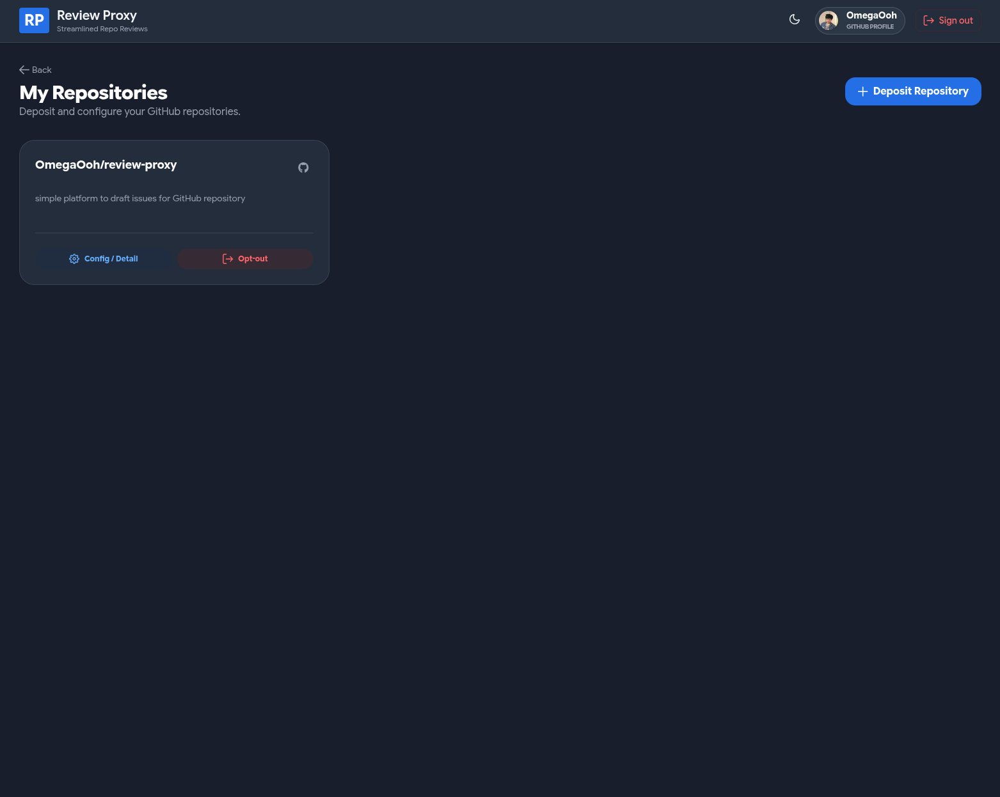
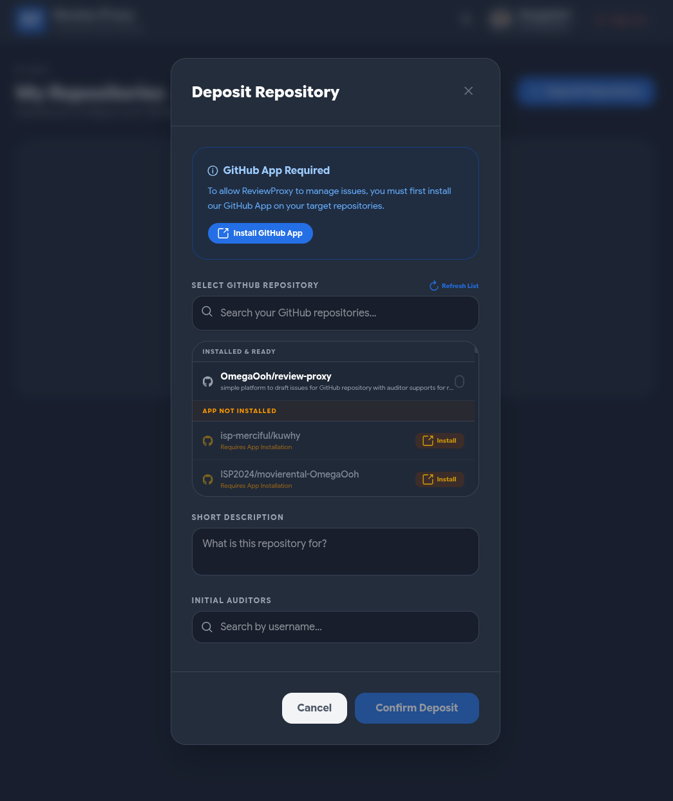
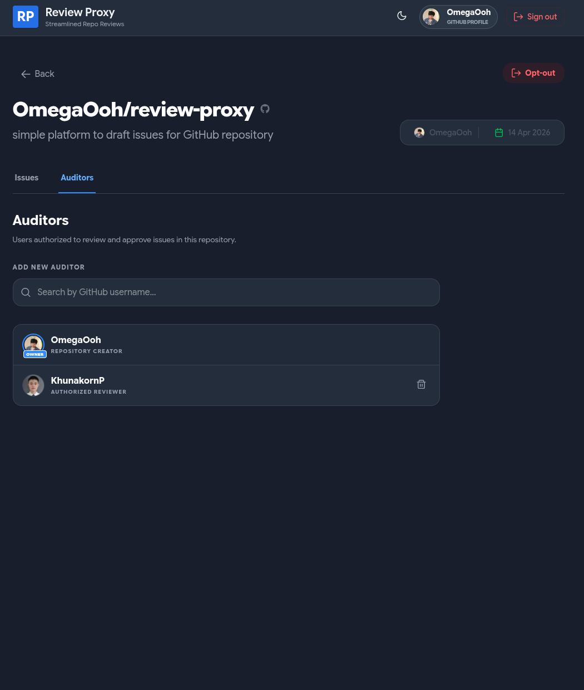
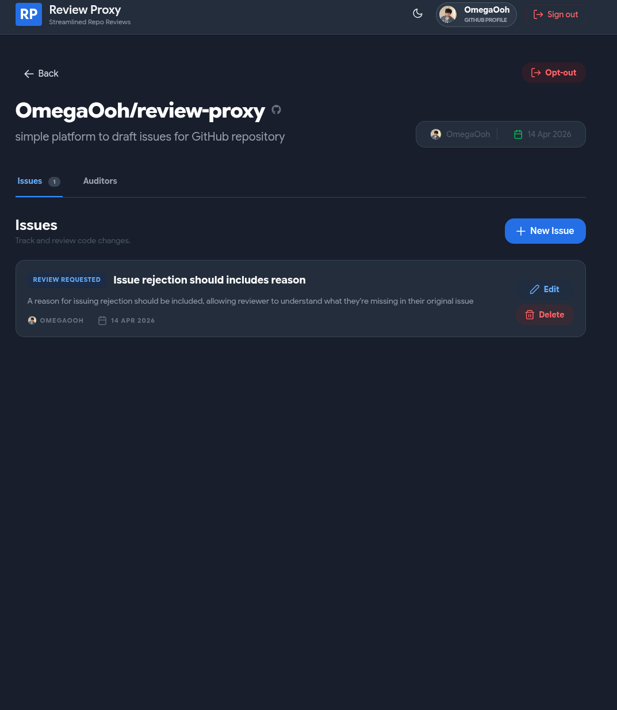
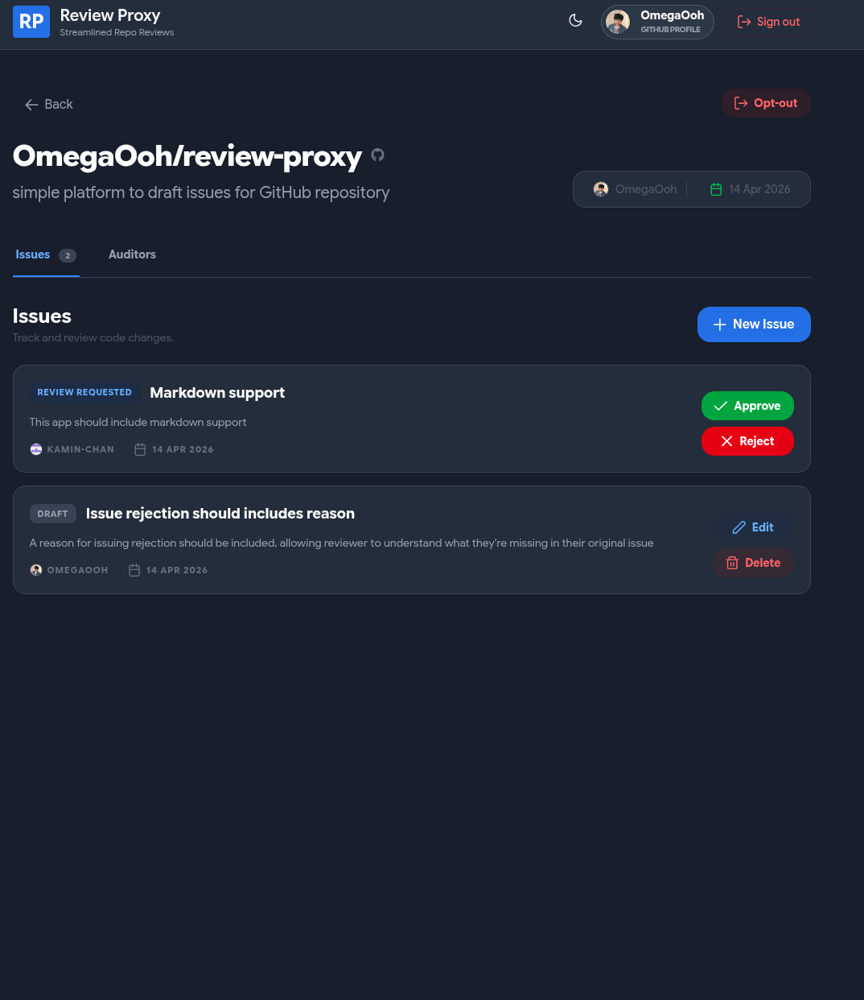
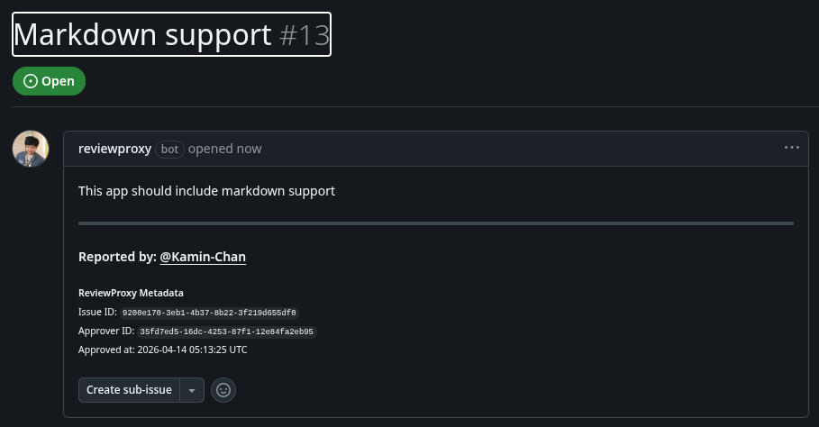

# Review Proxy

Review Proxy is a microservices platform designed to streamline the management and auditing of GitHub repository issues. It allows repository owners to deposit their projects and assign specialized auditors to review specific issues, ensuring a structured audit workflow.

## System Architecture

The application follows a distributed microservices pattern:

*   **API Gateway**: The central entry point using YARP to route traffic to backend services.
*   **Identity Service**: Handles user authentication and profiles through GitHub OAuth.
*   **Repository Service**: Manages repository registration and metadata storage.
*   **Issue Service**: Tracks repository issues and their respective audit statuses.
*   **Syncing Service**: Interfaces with the GitHub API to keep local data synchronized.
*   **Communication**: Services communicate asynchronously using RabbitMQ and MassTransit.
*   **Data Storage**: Each microservice utilizes its own PostgreSQL instance to ensure data isolation.

## User Roles and Permissions

*   **Owners**: Users who register repositories in the system. They have permission to manage repository settings and assign auditors to their projects.
*   **Auditors**: Specialized users assigned to repositories. They are responsible for reviewing issues and updating audit statuses.
*   **Registered Users**: Any user authenticated via GitHub who can browse repositories and view audit progress.

## Technology Stack

*   **Backend**: .NET 10, ASP.NET Core, Entity Framework Core, YARP, MassTransit.
*   **Frontend**: Vue 3, TypeScript, Pinia, PrimeVue, Tailwind CSS.
*   **Infrastructure**: Docker, Docker Compose, RabbitMQ.
*   **Database**: PostgreSQL.
*   **Package Management**: Bun for frontend dependencies and .NET CLI for backend.

## System Screenshots

### User Dashboard


*The landing page provides a high-level overview of all repositories currently registered in the system.*



*Users can easily manage their own projects and track their individual deposit statuses.*

### Repository Configuration


*The deposit workflow allows owners to select projects from their GitHub account and assign initial auditors.*



*Owners maintain full control over who is authorized to review issues within their projects.*

### Audit & Issue Management


*A centralized view for tracking the progress of various audit issues across a repository.*



*Auditors are provided with a dedicated interface to approve or reject issues, driving the audit lifecycle.*



*Review Proxy ensures that audit results are synchronized back to the original GitHub repository for transparent tracking.*

## GitHub Configuration

Review Proxy uses a single GitHub App to handle both user authentication (OAuth) and repository interactions.

### GitHub App Setup
1.  **Basic Information**: Set your Homepage URL (e.g. `http://localhost:3000`).
2.  **Identifying and Authorizing Users**:
    *   **Callback URL**: Set this to `http://localhost:8000/api/sync/signin-github` (or your production gateway URL).
    *   **Request user authorization (OAuth) during installation**: Enable this checkbox.
3.  **Permissions**:
    *   **Issues**: Read and write.
    *   **Metadata**: Read-only (mandatory).
4.  **Private Key**: Generate a private key and download the `.pem` file to your host machine.
5.  **Secrets**: Generate a Client Secret.

## Environment Variables

Configure these variables in your `.env` file or environment settings.

### Required (GitHub App)
*   **GitHub__ClientId**: Your GitHub App Client ID.
*   **GitHub__ClientSecret**: Your GitHub App Client Secret.
*   **GitHub__AppId**: Your GitHub App ID.
*   **GitHub__AppSlug**: Your GitHub App slug (found in the app public link).
*   **GitHub__PrivateKeyPath**: The path to your GitHub App `.pem` private key.

### Security and Internal Communication
*   **Services__InternalSecret**: A shared secret key used to authorize internal requests between microservices (e.g., Syncing to Identity). This should be a long, random string in production.
*   **Jwt__Key**: Secret key used for signing and validating internal JSON Web Tokens.

### Frontend
*   **VITE_API_URL**: The URL of the API Gateway (e.g. `http://localhost:8000`).

### Infrastructure and Database (Optional Overrides)
*   **MassTransit__Host**: Connection string for RabbitMQ (default: `rabbitmq://localhost:5672`).
*   **MassTransit__Username**: RabbitMQ username (default: `guest`).
*   **MassTransit__Password**: RabbitMQ password (default: `guest`).
*   **IdentityDbConnection**: PostgreSQL connection string for the Identity service.
*   **IssueDbContext**: PostgreSQL connection string for the Issue service.
*   **RepoDbConnection**: PostgreSQL connection string for the Repository service.
*   **ASPNETCORE_ENVIRONMENT**: Set to `compose` for Docker or `Development` for local runs.

## Production Considerations

When moving beyond a local development environment, keep the following in mind:

*   **Security**: Ensure all public endpoints (Gateway and Frontend) are served over HTTPS. Update your GitHub App Callback URL and Homepage URL accordingly.
*   **Secrets Management**: Do not store `.env` files or `.pem` keys in source control. Use a secure vault or environment injection provided by your hosting platform.
*   **Internal Communication**: Always set a strong `Services__InternalSecret` to prevent unauthorized internal API access.
*   **Database Reliability**: Configure managed PostgreSQL instances or ensure robust backup strategies for the Docker volumes.
*   **Scaling**: The microservices can be scaled independently. Ensure RabbitMQ is configured with high availability if needed.
*   **Monitoring**: Implement centralized logging and health checks for each service to monitor the distributed system effectively.

## How to Run

The project includes a utility script to manage the development environment.

1.  **Start the system**:
    ```bash
    ./scripts/dev.sh up
    ```
2.  **Access the application**:
    Open your browser and navigate to `http://localhost:3000`.
3.  **View logs**:
    If you need to troubleshoot, use:
    ```bash
    ./scripts/dev.sh logs [service-name]
    ```
4.  **Stop the system**:
    ```bash
    ./scripts/dev.sh down
    ```
